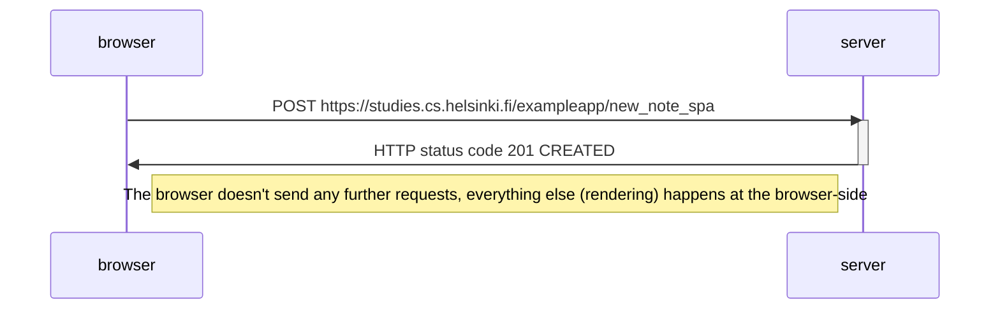

```mermaid
sequenceDiagram

  participant browser
  participant server

  browser->>server: POST https://studies.cs.helsinki.fi/exampleapp/new_note_spa
  activate server
  server->>browser: HTTP status code 201 CREATED
  deactivate server

  Note right of browser: The browser doesn't send any further requests, everything else (rendering) happens at the browser-side
```